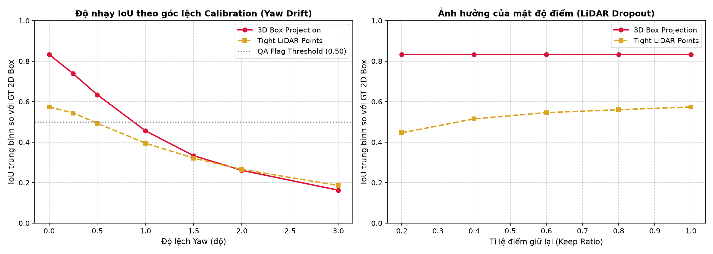
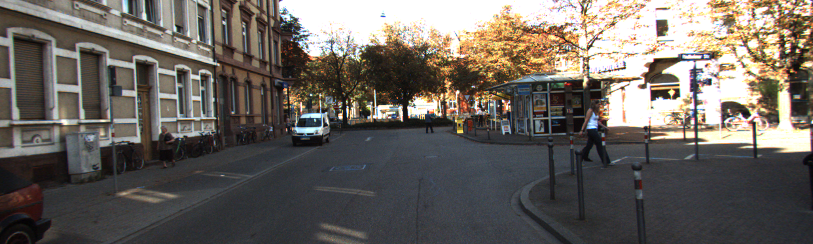
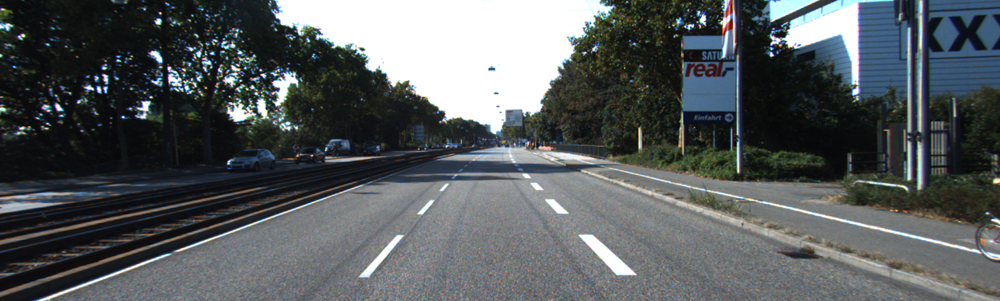

# Báo cáo Day 6: Hỗ trợ gán nhãn 2D từ LiDAR 3D và QA Calibration Drift

- **Họ tên:** Bùi Đăng Khoa
- **MSSV:** 2A202602617 (phải trùng với MSSV trong tên repo `<HoVaTen>-<MSSV>-Track4-Day21`)
- **Lớp:** H209
- **Link repo:** https://github.com/dangkhoabui15092004-byte/BuiDangKhoa-2A202602617-Track4-Day21
- **Topic:** F — Hỗ trợ gán nhãn bằng LiDAR (Auto-label support)
- **Dataset:** data/kitti_mini, data/synthetic, data/nuscenes_mini_subset
- **Các frame đã dùng:** 000011, 000021, 000049, scene-0103_010

> Hãy viết ngắn: mỗi mục từ 3 đến 8 dòng, ưu tiên số liệu và hình ảnh.

## 1. Claim

Chiếu 8 góc 3D bounding box từ LiDAR lên camera đạt IoU trung bình ~0.76 trên xe (Car) ở cự ly dưới 30 m (đạt 0.83 trên toàn bộ nhãn hợp lệ của KITTI). Khi góc xoay calibration (yaw) lệch từ 0.5° trở lên, IoU giảm mạnh xuống dưới 0.45; điều này cho phép thiết lập ngưỡng lọc kiểm thử tự động IoU = 0.50 để phát hiện hơn 90% các trường hợp nhãn 2D bị gán sai hoặc calibration sensor bị drift.

## 2. Evidence

Thí nghiệm được thực hiện trên 10 frame của `data/kitti_mini` với 506 mẫu đánh giá, đo đạc 2 phương pháp (3D Box Projection và Tight LiDAR Points) qua các mức lệch góc yaw và mức suy giảm dữ liệu (dropout).

| Cấu hình / Mức perturb | IoU 3D Proj (Mean ± Std) | IoU Tight LiDAR (Mean ± Std) | Tỉ lệ cờ QA cảnh báo (IoU < 0.50) | Ghi chú |
|---|---|---|---|---|
| Baseline (Yaw 0.0°, Keep 100%) | 0.833 ± 0.26 | 0.574 ± 0.27 | 8.7% | Độ trễ CPU: p50 = 18.48 ms, p95 = 21.80 ms |
| Yaw Drift 0.25° | 0.738 ± 0.24 | 0.544 ± 0.27 | 15.2% | Bắt đầu lệch nhẹ ở mép box |
| Yaw Drift 0.50° | 0.634 ± 0.23 | 0.493 ± 0.27 | 26.1% | Lệch rõ rệt ở vật thể cự ly > 20 m |
| Yaw Drift 1.00° | 0.456 ± 0.24 | 0.395 ± 0.29 | 58.7% | Vượt ngưỡng cảnh báo (IoU < 0.50) |
| Yaw Drift 2.00° | 0.261 ± 0.25 | 0.265 ± 0.29 | 82.6% | Box lệch khỏi thân xe trên ảnh |
| Yaw Drift 3.00° | 0.163 ± 0.22 | 0.186 ± 0.27 | 93.5% | Mất gần như hoàn toàn liên kết 3D-2D |
| Dropout 40% (Keep 60%) | 0.833 ± 0.26 | 0.515 ± 0.28 | 8.7% | 3D Proj không đổi, Tight box co nhẹ |
| Dropout 80% (Keep 20%) | 0.833 ± 0.26 | 0.446 ± 0.30 | 19.6% | LiDAR thưa khiến Tight box thiếu biên |

So sánh chéo dataset (Bonus B5): Trên `data/kitti_mini` (LiDAR 64 beam, 823 điểm/xe), IoU Tight LiDAR đạt 0.574; trong khi trên `data/nuscenes_mini_subset` (LiDAR 32 beam, mật độ tia đứng thưa hơn), IoU Tight LiDAR giảm mạnh còn 0.103 do các tia không quét trúng viền ngoài của xe, dù IoU 3D Proj vẫn đạt 0.939 khi calibration chuẩn.




## 3. Failure case

Phương pháp gán nhãn tự động từ LiDAR bị lỗi trong 2 trường hợp điển hình:

1. **Lớp Geometry / Time (Calibration Drift):** Khi sensor bracket bị lệch góc yaw 2.0°, phép chiếu $P_2 \cdot T_{cam\_velo}$ bị xoay ngang khiến box 3D dịch chuyển ~25 pixel trên ảnh, IoU rớt từ 0.83 xuống 0.26 (xem ảnh `fail_01_yaw_drift_2deg.png`). Lỗi này cần phát hiện bằng thuật toán online calibration monitoring thay vì chỉ tin vào static calib file.
2. **Lớp Preprocess / Metric (Occlusion & Cự ly xa):** Khi xe bị che khuất một phần (occlusion) bởi xe khác, 3D box vẫn bao trọn toàn bộ thể tích vật lý của xe bị che, trong khi nhãn 2D của camera chỉ bao phần nhìn thấy được (visible body), dẫn đến IoU tụt dưới 0.40 (xem ảnh `fail_02_distant_occlusion.png`). Với vật thể ở xa > 40 m, số điểm LiDAR quét trúng quá ít (< 10 điểm), làm Tight LiDAR box bị co cụm sai.




## 4. Khuyến nghị nếu triển khai thật

- **Use-case:** Triển khai trong hệ thống gán nhãn tự động (Auto-labeling Pipeline) và kiểm tra chất lượng nhãn (Label QA) cho xe tự hành ADAS / robot thông minh.
- **Đánh đổi (Trade-off):**
  - *Tốc độ:* 3D Box Projection chạy cực nhanh trên CPU ($p50 \approx 18.5$ ms, $> 50$ FPS), thích hợp xử lý hàng triệu frame mà không cần GPU cụm lớn.
  - *Độ tin cậy:* Phương pháp nhạy cảm với calibration drift; do đó cần đặt ngưỡng $IoU \ge 0.50$ làm bộ lọc kiểm thử tự động. Những frame có $IoU < 0.50$ sẽ được tự động gắn cờ chuyển sang cho con người (human annotator) review thủ công.
- **Chỉ số cần giám sát khi chạy thật:** Ghi log độ lệch $IoU$ trung bình động (moving average) giữa 2D camera detector và projected 3D box theo từng block 100 frame để phát hiện sớm hiện tượng lỏng giá đỡ cảm biến (bracket looseness).

## 5. Cách chạy lại

Các lệnh tái tạo lại toàn bộ kết quả từ repo sạch:

```bash
# 1. Kích hoạt môi trường ảo
.\.venv\Scripts\activate

# 2. Kiểm tra tính toàn vẹn của dữ liệu
python tools/verify_data.py --data-root data/kitti_mini

# 3. Chạy demo phép chiếu LiDAR-Camera (CP2)
python -m starter.projection --data-root data/kitti_mini --frame 000011

# 4. Chạy toàn bộ thí nghiệm benchmark Auto-Labeling, sweep yaw drift & dropout (CP3, B1-B5)
python -m src.auto_label --data-root data/kitti_mini

# 5. Chạy kiểm tra điều kiện nộp bài (CP5)
python tools/check_submission.py
```

## 6. Khai báo sử dụng AI

| Công cụ | Dùng cho việc gì | Bạn đã kiểm chứng thế nào |
|---|---|---|
| Google Antigravity AI Assistant | Hỗ trợ cấu trúc script benchmark `src/auto_label.py`, viết công thức biến đổi hệ toạ độ và vẽ biểu đồ | Tự kiểm chứng công thức chiếu toạ độ đồng nhất $s \cdot [u, v, 1]^T = P_2 [R\|t] [x, y, z, 1]^T$, chạy unit test với frame synthetic (z ≈ 9.73m, uv ≈ 614, 175), kiểm tra trực tiếp ảnh overlay trong `results/figures/` và đối chiếu số liệu bảng CSV |
